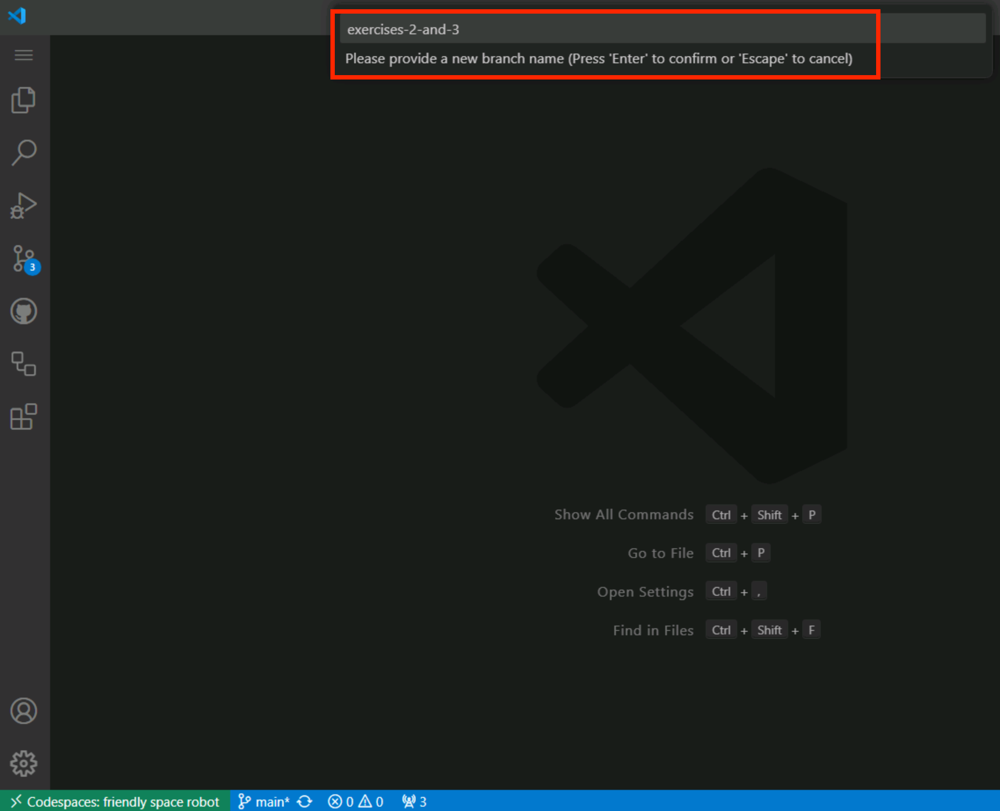
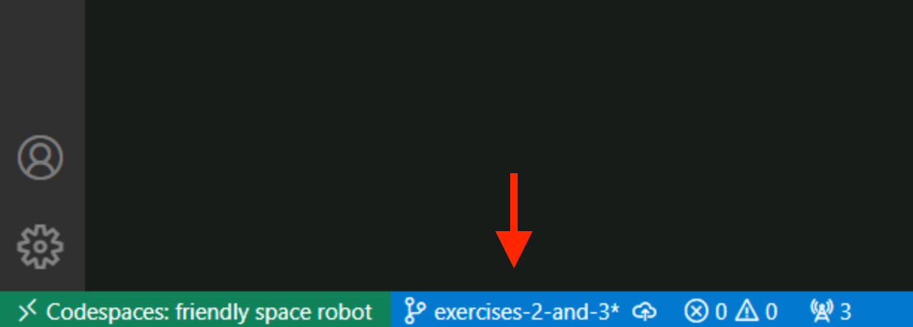
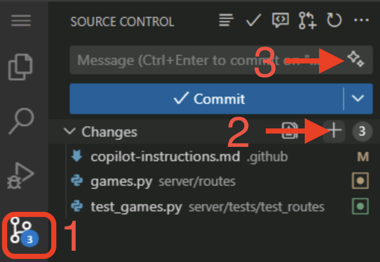

# Exercise 2 - Providing context and templates to Copilot

As with much of life in general, context is key when working with generative AI. If you're performing a task which needs to be completed a particular way, or a piece of background information is important, we want to ensure Copilot has access to that information. There's a couple of mechanisms we have to ensure Copilot not only knows what we want it to do but how we want it to do it - [custom instructions](https://code.visualstudio.com/docs/copilot/copilot-customization) and [prompt files](https://code.visualstudio.com/docs/copilot/copilot-customization#_reusable-prompt-files-experimental).

In this exercise, you will learn:
- How to provide Copilot with project-specific context, coding guidelines and documentation standards using custom instructions
- How to use prompt files to guide Copilot for repetitive or templated tasks
- The difference between repository-wide instructions and task-specific prompts

## Scenario

As any good dev shop, a set of guidelines and requirements have been put forth for development. These include:

- API always needs unit tests
- UI should be in dark mode and have a modern feel
- Documentation should be added to code

Through the use of custom instructions and prompt files you'll ensure Copilot has the right information to perform the tasks in alignment with the practices highlighted.

> [!IMPORTANT]
> Custom instructions and prompt files are only considered by Copilot Chat at the time of this writing, including ask, edit and agent mode. Code completions are not yet supported. 

## Before you begin

We're going to be making some code changes, so we should follow our usual practice of creating a new branch to work in. This will allow us to make changes without affecting the main branch until we're ready.

1. Click on the branch name in the bottom left corner of the Codespace.

   

2. Select **Create new branch**.

   

3. Name the branch **exercises-2-and-3** and select **Create branch**.

   

4. The branch name should have updated in the bottom left corner of the Codespace.

   

## Custom instructions

Custom instructions allow you to provide context and preferences to Copilot chat, so that it can better understand your coding style and requirements. This is a powerful feature that can help you steer Copilot to get more relevant suggestions and code snippets. You can specify your preferred coding conventions, libraries, and even the types of comments you like to include in your code.

> [!NOTE]
> Custom instructions are sent with **every** prompt to Copilot chat. As a result, it's best to keep the content focused on guidelines and information relevant to the entire project rather than specific tasks. For specific tasks you can create prompt files, which we'll cover a little later in this exercise.

## Create custom instructions for your project

To see the impact of custom instructions, we will start by sending a prompt before creating the file. We'll then create the file, send the same prompt again, and notice the difference.

1. Open the GitHub Codespace if not already open. Feel free to close any open files from the previous exercise.
2. Open **server/routes/games.py**.
3. Open **Copilot chat** and ensure **Ask** is selected from modes.
4. Create a new chat session if needed using the **New Chat** button, to make sure you are not bringing any previous context.

   

5. Send the following prompt to create a new endpoint to return all publishers:

```plaintext
Create a new endpoint to return a list of all publishers. It should include the name and id.
```

5. Notice the generated code includes [type hints](https://docs.python.org/3/library/typing.html) because the existing code uses them. Copilot uses the current file for context when creating code, and will work to follow the practices it sees in use.
6. Notice the generated code **does not** include a docstring. Copilot is again following the patterns it sees us using, and since docstrings don't already exist it doesn't generate them.

If we look at the requirements from above, we see we want to include docstrings for functions. Let's create the custom instructions file with this information, as well as an overview of what we're building in our project. Providing background to Copilot will allow it to generate better suggestions.

7. Open **.github/copilot-instructions.md**.
8. Add the following to the bottom of the file to add the requirement for docstrings

```markdown
## Code guidelines

- Create docstrings for Python
- Add JSDoc notes to JavaScript
```

9. Save the file.
10. Open **server/routes/games.py** again to ensure focus for Copilot chat is on our API.
11. Select **New Chat** in Copilot chat to clear the buffer and start a new conversation.

   

12. Send the same prompt as before to create the endpoint.

```plaintext
Create a new endpoint to return a list of all publishers. It should include the name and id.
```

13. Notice how the newly generated code includes a docstring inside the function which resembles the following:

   ```python
   """
   Returns a list of all publishers with their id and name.
    
   Returns:
      Response: JSON response containing an array of publisher objects
   """
   ```

14. Don't implement Copilot's suggested changes, as we will be doing that in the next section. But from this section, you can see how the custom instructions file has provided Copilot with the context it needs to generate code that follows the established guidelines.

## Prompt files for tasks

Coding is often repetitive, with developers performing similar tasks on a regular basis. Copilot is wonderful for allowing you to offload these types of tasks. But these types of tasks, like adding an endpoint, creating a component, or adding a new service pattern implementation often require a particular template or structure to be followed. Prompt files allow you to provide specific requirements for these types of tasks.

We want to create a new endpoint to list all publishers, and to follow the same pattern we used for the existing [games endpoints](../server/routes/games.py), and to create tests which follow the same pattern as the existing [games endpoints tests](../server/tests/test_routes/test_games.py). A prompt file has already been created; let's explore it and see the difference in code it generates.

1. Open **.github/prompts/create-endpoint.prompt.md**.
2. Review the following entries inside the prompt file:

   - An overview of requirements, including that tests must be created, mock objects to be used, and endpoints are created in Flask using blueprints.
   - Links to two existing files which follow the patterns we want - both the games blueprint and tests. Notice how these are setup as normal markdown links, allowing a prompt file to incorporate additional files for context.

3. Open **server/app.py**.
4. Return to Copilot Chat and select **New Chat**.
5. Select **Edit** from the mode dropdown.

   

6. Add the prompt file to the chat by clicking the **Add Context** button, select **Prompt** and select **.github/prompts/create-endpoint.prompt.md**.

   

7. Send the same prompt as before to generate the desired endpoint:

```plaintext
Create a new endpoint to return a list of all publishers. It should include the name and id.
```

8. Copilot generates the files. Notice how it generates updates for **app.py** as well as new files for the blueprint and tests for the publishers endpoint.
9. **Optional steps:** Check that the tests run correctly by running the following commands:
  - Run `source venv/bin/activate` to activate the project’s Python virtual environment so that subsequent Python commands use the locally installed dependencies.
  - Run  `python -m unittest discover server/tests` in the terminal. You should see that all tests pass.
10. After reviewing the code, select **Keep** and **Done** in Copilot Chat to accept the changes.
11. Navigate to the **Source Control** panel in the Codespace and review the changes made by Copilot. Once you're happy, stage the changes. You can then generate a commit message using the **Sparkle** button.

   

12. Commit the changes to your repository.

## Summary

Congratulations! You explored how to ensure Copilot has the right context to generate code following the practices your organization has set forth. This can be done at a repository level with custom instructions, or on a task basis with prompt files.
