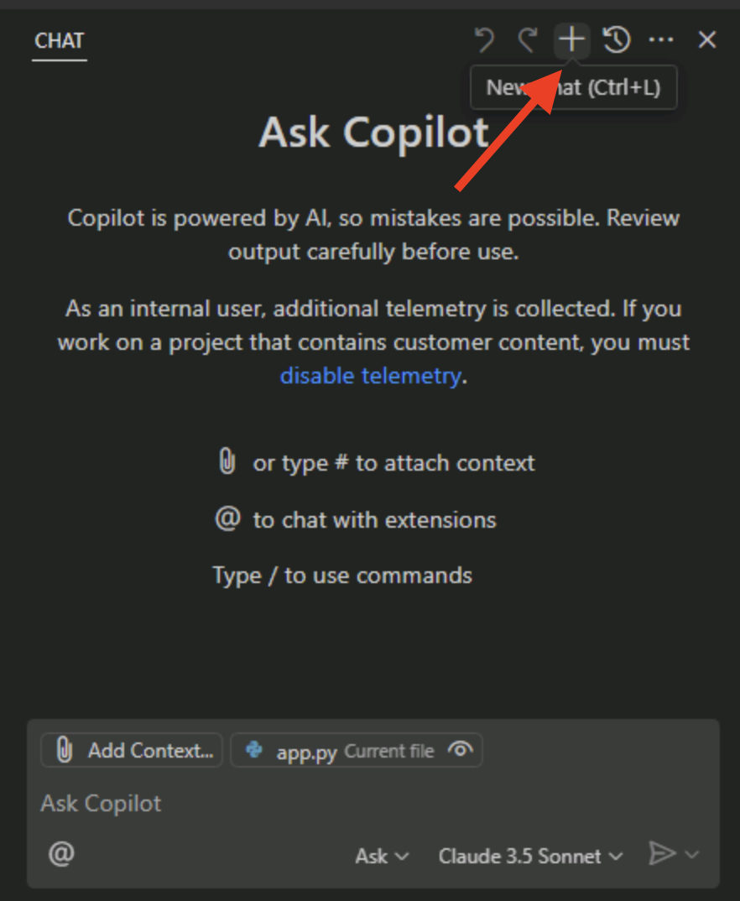
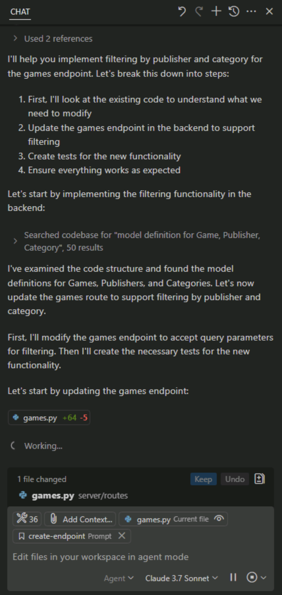
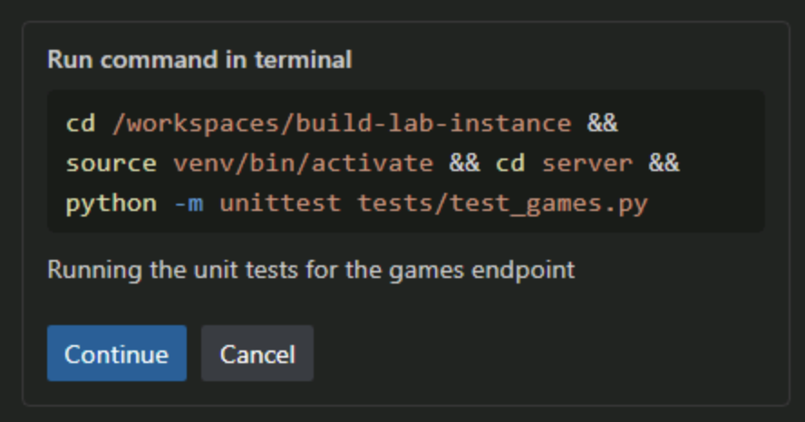
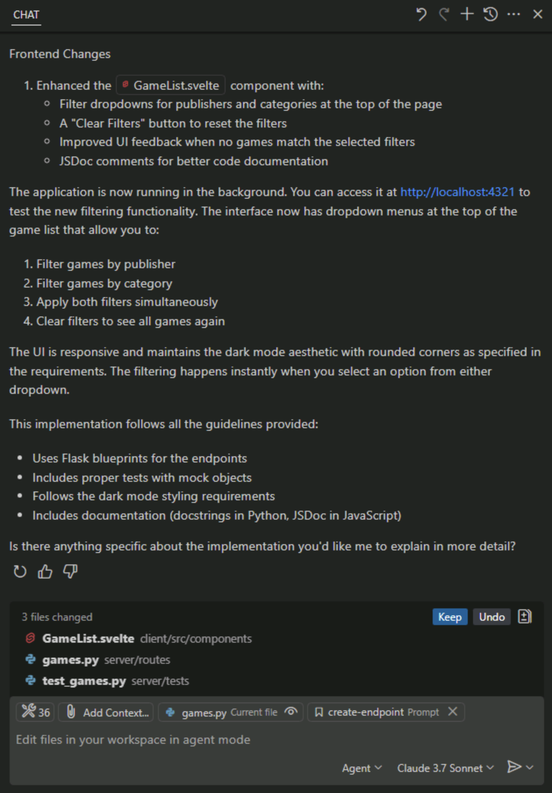
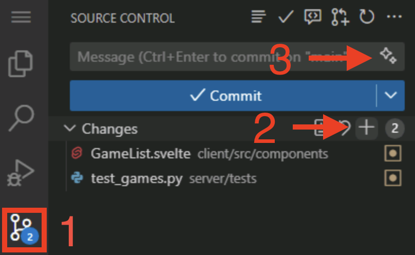

# Exercise 3 - Adding new functionality with Copilot Agent Mode

Even the simplest of updates to an application typically require updates to multiple files and operations to be performed like running tests. As a developer your flow typically involves tracking down all the necessary files, making the changes, running the tests, debugging, figuring out which file was missed, making another update... This is where Copilot Agent Mode comes into play.

Copilot Agent Mode is built to act more autonomously. It behaves in a similar fashion to a developer, starting by exploring the existing project structure, performing the necessary updates, running tasks like tests, and automatically fixing any discovered mistakes. Let's explore how we can use Agent Mode to introduce new functionality to our site.

In this exercise, you will learn:
- How to use GitHub Copilot Agent Mode to implement new features across both backend and frontend codebases
- How Copilot Agent Mode can explore your project, identify relevant files, and make coordinated changes
- Considerations for reviewing and running changes and tests generated by Copilot Agent Mode before merging into your codebase

## Scenario

As the list of games grows, you want to allow users to filter by category. This will require updating both the API and UI, and updating the tests for the API. With the help of Copilot Agent Mode you'll work with your AI pair programmer to add the new feature! 

## Running the Tailspin Toys website

Before we make any changes, let's explore the Tailspin Toys website to understand its current functionality. 

The website is a crowdfunding platform for board games with a developer theme. It allows users to list games and display details about them. The website has two main components: the front-end (written in Svelte) and the backend (written in Python).

### Starting the website

To make running the website easier, we have provided a script that will start both the front-end and back-end servers. You can run this script in your GitHub Codespace to start the website with the following instructions:

1. In your GitHub Codespace, open a terminal.
2. Run the following script to start the website:

   ```bash
   scripts/start-app.sh
   ```

   Once the script is running, you should see output indicating that both the front-end and back-end servers are running, similar to the below:

   ```bash
   Server (Flask) running at: http://localhost:5100
   Client (Astro) server running at: http://localhost:4321
   ```

3. Open the website by using <kbd>Ctrl</kbd>-**Click** (or <kbd>Cmd</kbd>-**Click** on a Mac) on the client address (http://localhost:4321) in the terminal.

> [!NOTE]
> When accessing GitHub Codespaces:
> - If you're using Codespaces in a web browser: Clicking the localhost URL from the Codespace terminal will automatically redirect you to `https://<your-codespace-name>-4321.app.github.dev/`
> - If you're running Codespaces locally through VS Code or using a local development environment: You can access the site directly via `http://localhost:4321`


### Exploring the website

Once the website is running, you can explore its functionality. The main features of the website include:

- **Home Page**: Displays a list of board games with their titles, images, and descriptions.
- **Game Details Page**: When you click on a game, it takes you to a details page with more information about the game, including its title, description, and image.

## Exploring the backlog from Copilot

The initial implementation of the website is functional, but we want to enhance it by adding new capabilities. Let's start off by reviewing the backlog. Ask GitHub Copilot to show you the backlog of items that we created in the previous exercise.

1. Open **Copilot Chat** and ensure **Agent** is selected from the list of modes.

   

2. Ask Copilot about the backlog of issues by sending the following prompt to Copilot:

   ```plaintext
   Please show me the backlog of items from the GitHub repository. Help me prioritize them based on those which will be most useful to the user.
   ```

You'll notice that GitHub Copilot made a tool call similar to our previous exercise, using the `list_issues` tool to get the list of issues from the GitHub repository. But with the power of AI, it has even gone and prioritized the items for us, based on the ones that it thinks will be most useful to the user.

## Implementing the filtering functionality

To implement filtering, no less than three separate updates will need to be made to the application:

- A new endpoint added to the API
- A new set of tests for the new endpoint
- Updates to the UI to introduce the functionality

In addition, the tests need to run (and pass) before we merge everything into our Codebase. Copilot Agent Mode can perform these tasks for us! Let's add the functionality.

1. Open Copilot Chat. Create a new chat session if needed using the **New Chat** button, to make sure you are not bringing any previous context.

   

2. Select **Add Context**, **Prompt file**, and **create-endpoint.prompt.md** as the prompt file.

   

3. Select **Agent** mode.

   

4. Select **Claude 3.7** for the model.
5. Prompt Copilot to implement the functionality based on the issue we created earlier by using the following prompt:

   ```plaintext
   Please update the site to include filtering by publisher and category based on the requirements from the GitHub issue in the backlog of our repo.
   ```

6. Watch as Copilot begins by exploring the project, locating the files associated with the desired functionality. You should see it finding both the API and UI definitions, as well as the tests. It then begins modifying the files and running the tests.

   

7. As prompted by Copilot, select **Run** to run the tests.

   

8. Copilot may work back and forth between code generation and tests until it completes the task and doesn't detect any errors.

   

9. Explore the generated code for any potential issues.

> [!IMPORTANT]
> Remember, it's always important to review the code that Copilot or any AI tools  generate.

10. Return to the browser with the website running. Explore the new functionality!

## Reviewing and merging changes

1. Navigate to the **Source Control** panel in the Codespace and review the changes made by Copilot. Once you're happy, stage the changes. You can then generate a commit message using the **Sparkle** button.

   

2. Once you have committed your changes, you can push them to the repository.

3. At this point we want to create a Pull Request (PR) to merge the changes into the main branch of the repository. We have multiple options for this:

  - We could create a pull request via the GitHub UI in the browser.
  - We could use the GitHub Extension in our Codespace to create the pull request.
  - Or, you may remember that we installed the GitHub MCP Server in the first exercise. So why not ask Copilot to create a Pull Request

4. Navigate to the **Copilot Chat** panel and ask Copilot to create a PR for you (Make sure to update the repository name to your own):

   ```plaintext
   I need you to create a pull request, please complete the following steps:

   1. Review the files that have changed in my local `exercises-2-and-3` branch. Summarize the overall changes based on file changes and commit messages.
   2. Use the previous description to create a pull request to my repository **owner/name**.
   ```

> [!NOTE]
> Review the above prompt. What context does it provide? What information is missing? How could you improve the prompt to get a better response from Copilot?

## Summary

Congratulations! In this exercise, we explored how to use GitHub Copilot Agent Mode to add new capabilities to the Tailspin Toys website. We learned how to run the website, explore its functionality, and use GitHub Copilot to create new features based on our backlog.
